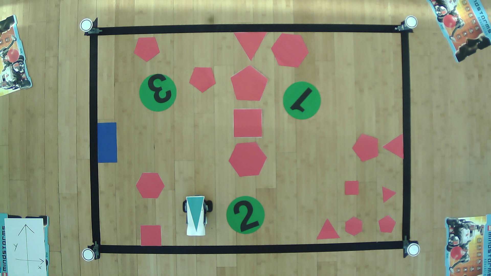

# Laboratory of Applied Robotics project
**Team: [Askhat Issakov](https://github.com/askhissak), [César González C.](https://github.com/Chesare9000)**

A final project for Laboratory of Applied Robotics class at **University of Trento, 2018-2019**. The main goal of the project is to implement computer vision and path planning algorithms for LEGO MINDSTORMS NXT robot. The code is written in C++.

## Setup

The main sensor is a video camera mounted on the ceiling and looking down at the scene. The scene consists of 5 main elements (Picture 1):
1. The map is a rectangular area delimited by the black tape on the floor. The corners are indicated by the raised white circles.
2. The robot is a two-wheeled mobile platfrom with a blue triangle on top. The base of the triangle indicates the forward direction.
3. The gate is a blue rectangle attached to the wall. It indicates the target exit.
4. The obstacles are the red shapes all over the map indicating areas to avoid.
5. The victims are the numbered green circles indicating points of interests (POI) to be passed along the route to the exit.



## Dependencies

* [OpenCV 4.x.x](https://docs.opencv.org/4.6.0/d1/dfb/intro.html)
* [Tesseract 4.x.x](https://github.com/tesseract-ocr/tesseract)

### Ubuntu 22.04:

```bash
sudo apt install libopencv-dev libtesseract-dev
```

For installation instructions on other platforms refer to the official documentation.

## Building

```bash
git clone https://github.com/askhissak/lar-project.git
cd lar-project
make
```

## Usage

From the project root:

```bash
./build/apps/program data/dataset/data/img/2018-12-20-122754.jpg
```
